<div align="center">

<!-- Theme-Aware Header -->
<picture>
  <source media="(prefers-color-scheme: dark)" srcset="https://raw.githubusercontent.com/ARPANPATRA111/ARPANPATRA111/main/assets/header-dark.svg" />
  <source media="(prefers-color-scheme: light)" srcset="https://raw.githubusercontent.com/ARPANPATRA111/ARPANPATRA111/main/assets/header-light.svg" />
  
</picture>

<!-- Profile Stats Badges - Using shields.io for real-time data -->


<!-- Snake Animation -->
<picture>
  <source media="(prefers-color-scheme: dark)" srcset="https://raw.githubusercontent.com/ARPANPATRA111/ARPANPATRA111/output/github-snake-dark.svg" />
  <source media="(prefers-color-scheme: light)" srcset="https://raw.githubusercontent.com/ARPANPATRA111/ARPANPATRA111/output/github-snake.svg" />
  
</picture>

</div>

# 💫 About Me

<table width="100%">
<tr>
<td width="50%" valign="top">

```yaml
name: Arpan Patra
located_in: India 🇮🇳
current_role: Full Stack Developer
education: Computer Application Student

fields_of_interests:
  - Web Development
  - Mobile App Development  
  - Cloud Architecture
  - Open Source

currently_learning:
  - React.js & Next.js
  - Cloud Architecture (AWS)
  - System Design

2026_goals:
  - Contribute to Open Source
  - Build Production Apps
  - Master Cloud Technologies
```

</td>
<td width="50%" valign="middle" align="center">

</td>
</tr>
</table>


<!-- Social Section -->
<div>
  
## 🌐 Socials

[](mailto:thispc119@gmail.com)
[](https://arpan111.vercel.app)
[](https://linkedin.com/in/arpan-patra-1b1041320)
[](https://x.com/Arpan5305)
[](https://youtube.com/@AMDz-cd7ts)

</div>


## 📊 Coding Stats Dashboard

<!-- Combined Quick Stats & Coding Time - 4x3 Grid -->
<div align="center">

<table>
<tr>
<td align="center" width="33%">

<!--START_TODAY_STAT--><!--END_TODAY_STAT-->
</td>
<td align="center" width="33%">

<!--START_YESTERDAY_STAT--><!--END_YESTERDAY_STAT-->
</td>
<td align="center" width="33%">

<!--START_THISWEEK_STAT--><!--END_THISWEEK_STAT-->
</td>
</tr>
<tr>
<td align="center" width="33%">

<!--START_PRODUCTIVE_DAY--><!--END_PRODUCTIVE_DAY-->
</td>
<td align="center" width="33%">

<!--START_TOP_LANGUAGE--><!--END_TOP_LANGUAGE-->
</td>
<td align="center" width="33%">

<!--START_TOP_EDITOR--><!--END_TOP_EDITOR-->
</td>
</tr>
<tr>
<td align="center" width="33%">

<!--START_AVG_DAILY--><!--END_AVG_DAILY-->
</td>
<td align="center" width="33%">

<!--START_ACTIVE_DAYS--><!--END_ACTIVE_DAYS-->
</td>
<td align="center" width="33%">

<!--START_WEEK_CHANGE_BADGE--><!--END_WEEK_CHANGE_BADGE-->
</td>
</tr>
<tr>
<td align="center" width="33%">

<!--START_COMMITS_STAT--><!--END_COMMITS_STAT-->
</td>
<td align="center" width="33%">

<!--START_PRS_STAT--><!--END_PRS_STAT-->
</td>
<td align="center" width="33%">

<!--START_ISSUES_STAT--><!--END_ISSUES_STAT-->
</td>
</tr>
</table>

</div>

---

## 📈 Weekly Activity

<div align="center">

<!--START_WEEKLY_CHART-->
<picture>
  <source media="(prefers-color-scheme: dark)" srcset="./assets/weekly-activity-dark.svg" />
  <source media="(prefers-color-scheme: light)" srcset="./assets/weekly-activity-light.svg" />
  
</picture>
<!--END_WEEKLY_CHART-->

<sub>🕒 Last Updated: <!--START_UPDATE_DATE-->2026-01-08 16:18:55 UTC<!--END_UPDATE_DATE--> | ⚡ Powered by <a href="https://wakatime.com/">WakaTime</a></sub>

</div>

---

## 💻 Tech Stack:
                                       

## 🏆 Badges & Achievements

<table width="100%">
<tr>
<td width="50%">

### 🥇 LeetCode
<p align="center">
  
  
  
  
  
</p>

</td>
<td width="50%">

### 🎓 Professional Certifications
<p align="center">
  <a href="https://www.credly.com/badges/5f3abcc4-44f2-4439-a307-4b4239a14ccc">
    
  </a>
  <a href="https://www.credly.com/badges/a8aadffd-af3e-4e5d-9f95-881c81260025">
    
  </a>
  <a href="https://www.credly.com/badges/9da4a728-61f6-4305-bc9c-5dc804ade605">
    
  </a>
  <a href="https://edu.google.accredible.com/d7e23f1f-3a00-4684-804e-abecfd12c6ae">
    
  </a>
  <a href="https://www.futureskillsprime.in/iDH/user/user_badge/view/32914_BG_10fe9856-d1dd-11f0-bdec-005056b48b54">
    
  </a>
</p>

</td>
</tr>
</table>

## 📊 GitHub Stats 

<br/>

## 🏆 GitHub Trophies

<!--START_GITHUB_TROPHIES-->
<picture>
  <source media="(prefers-color-scheme: dark)" srcset="https://raw.githubusercontent.com/ARPANPATRA111/ARPANPATRA111/main/assets/github-trophies-dark.svg" />
  <source media="(prefers-color-scheme: light)" srcset="https://raw.githubusercontent.com/ARPANPATRA111/ARPANPATRA111/main/assets/github-trophies-light.svg" />
  
</picture>
<!--END_GITHUB_TROPHIES-->

<!-- Fallback to external API if local trophies not available -->
<details>
<summary>🏆 External Trophy View (Click to expand)</summary>


</details>

## 🔥 Contribution Graph

<!--START_CONTRIBUTION_GRAPH-->
<picture>
  <source media="(prefers-color-scheme: dark)" srcset="https://raw.githubusercontent.com/ARPANPATRA111/ARPANPATRA111/main/assets/contribution-graph-dark.svg" />
  <source media="(prefers-color-scheme: light)" srcset="https://raw.githubusercontent.com/ARPANPATRA111/ARPANPATRA111/main/assets/contribution-graph-light.svg" />
  
</picture>
<!--END_CONTRIBUTION_GRAPH-->

<!-- Classic Snake Animation (Fallback) -->
<details>
<summary>🐍 Snake Animation (Click to expand)</summary>

<picture>
  <source media="(prefers-color-scheme: dark)" srcset="https://raw.githubusercontent.com/ARPANPATRA111/ARPANPATRA111/output/github-snake-dark.svg" />
  <source media="(prefers-color-scheme: light)" srcset="https://raw.githubusercontent.com/ARPANPATRA111/ARPANPATRA111/output/github-snake.svg" />
  
</picture>

</details>

## 🎯 Featured Project

<!--START_FEATURED_PROJECT-->
<div align="center">
<a href="https://github.com/ARPANPATRA111/AtMark">
<picture>
  <source media="(prefers-color-scheme: dark)" srcset="https://raw.githubusercontent.com/ARPANPATRA111/ARPANPATRA111/main/assets/featured-project-dark.svg" />
  <source media="(prefers-color-scheme: light)" srcset="https://raw.githubusercontent.com/ARPANPATRA111/ARPANPATRA111/main/assets/featured-project-light.svg" />
  
</picture>
</a>
</div>
<!--END_FEATURED_PROJECT-->

> 💡 **Tip**: To change the featured project, update the `data/featured-project.json` file with your preferred repo URL!

## 📂 More Projects

[](https://github.com/ARPANPATRA111/AtMark)
[](https://github.com/ARPANPATRA111/TripBudget)
[](https://github.com/ARPANPATRA111/Fitness-Dashboard)
[](https://github.com/ARPANPATRA111/Float-Chat)
[](https://github.com/ARPANPATRA111/MOB-APP)
[](https://github.com/ARPANPATRA111/Medix-manager)

<div align="center">

<!-- Theme-Aware Footer -->
<picture>
  <source media="(prefers-color-scheme: dark)" srcset="https://raw.githubusercontent.com/ARPANPATRA111/ARPANPATRA111/main/assets/footer-dark.svg" />
  <source media="(prefers-color-scheme: light)" srcset="https://raw.githubusercontent.com/ARPANPATRA111/ARPANPATRA111/main/assets/footer-light.svg" />
  
</picture>

</div>
