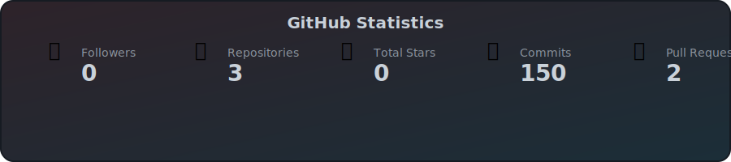
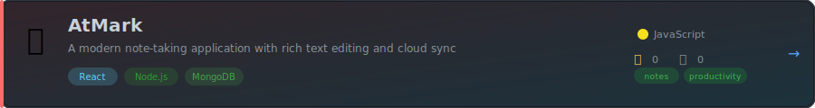
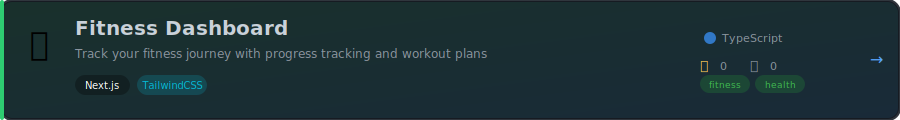
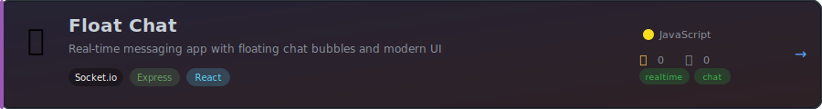
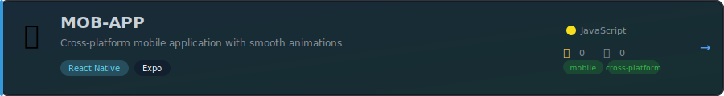

<!-- 
  GitHub Profile README - Arpan Patra
  Theme: Auto-switches between dark/light based on system preference
  All components are self-generated without external API dependencies
-->

<div align="center">

<!-- Theme-Aware Header -->
<picture>
  <source media="(prefers-color-scheme: dark)" srcset="https://raw.githubusercontent.com/ARPANPATRA111/ARPANPATRA111/wall-experiments/assets/header-dark.svg" />
  <source media="(prefers-color-scheme: light)" srcset="https://raw.githubusercontent.com/ARPANPATRA111/ARPANPATRA111/wall-experiments/assets/header-light.svg" />
  
</picture>

<!-- Banner -->
<picture>
  <source media="(prefers-color-scheme: dark)" srcset="./assets/Banner.png" />
  <source media="(prefers-color-scheme: light)" srcset="./assets/Banner.png" />
  
</picture>

<!-- Snake Animation -->
<picture>
  <source media="(prefers-color-scheme: dark)" srcset="https://raw.githubusercontent.com/ARPANPATRA111/ARPANPATRA111/output/github-snake-dark.svg" />
  <source media="(prefers-color-scheme: light)" srcset="https://raw.githubusercontent.com/ARPANPATRA111/ARPANPATRA111/output/github-snake.svg" />
  
</picture>

<br/>

<!-- Profile Stats Badges - Using shields.io for real-time data -->
<a href="https://github.com/ARPANPATRA111?tab=followers">
  
</a>
&nbsp;
<a href="https://github.com/ARPANPATRA111?tab=repositories">
  
</a>
&nbsp;


</div>

---

<!-- Social Section with Gradient Animation -->
<div align="center">
  
## 🌐 Connect With Me

<a href="https://linkedin.com/in/arpan-patra-1b1041320">
  <picture>
    <source media="(prefers-color-scheme: dark)" srcset="https://raw.githubusercontent.com/ARPANPATRA111/ARPANPATRA111/wall-experiments/assets/social-linkedin-dark.svg" />
    <source media="(prefers-color-scheme: light)" srcset="https://raw.githubusercontent.com/ARPANPATRA111/ARPANPATRA111/wall-experiments/assets/social-linkedin-light.svg" />
    
  </picture>
</a>
&nbsp;&nbsp;
<a href="https://x.com/Arpan5305">
  <picture>
    <source media="(prefers-color-scheme: dark)" srcset="https://raw.githubusercontent.com/ARPANPATRA111/ARPANPATRA111/wall-experiments/assets/social-twitter-dark.svg" />
    <source media="(prefers-color-scheme: light)" srcset="https://raw.githubusercontent.com/ARPANPATRA111/ARPANPATRA111/wall-experiments/assets/social-twitter-light.svg" />
    
  </picture>
</a>
&nbsp;&nbsp;
<a href="https://youtube.com/@AMDz-cd7ts">
  <picture>
    <source media="(prefers-color-scheme: dark)" srcset="https://raw.githubusercontent.com/ARPANPATRA111/ARPANPATRA111/wall-experiments/assets/social-youtube-dark.svg" />
    <source media="(prefers-color-scheme: light)" srcset="https://raw.githubusercontent.com/ARPANPATRA111/ARPANPATRA111/wall-experiments/assets/social-youtube-light.svg" />
    
  </picture>
</a>
&nbsp;&nbsp;
<a href="mailto:thispc119@gmail.com">
  <picture>
    <source media="(prefers-color-scheme: dark)" srcset="https://raw.githubusercontent.com/ARPANPATRA111/ARPANPATRA111/wall-experiments/assets/social-email-dark.svg" />
    <source media="(prefers-color-scheme: light)" srcset="https://raw.githubusercontent.com/ARPANPATRA111/ARPANPATRA111/wall-experiments/assets/social-email-light.svg" />
    
  </picture>
</a>
&nbsp;&nbsp;
<a href="https://arpan111.vercel.app">
  <picture>
    <source media="(prefers-color-scheme: dark)" srcset="https://raw.githubusercontent.com/ARPANPATRA111/ARPANPATRA111/wall-experiments/assets/social-portfolio-dark.svg" />
    <source media="(prefers-color-scheme: light)" srcset="https://raw.githubusercontent.com/ARPANPATRA111/ARPANPATRA111/wall-experiments/assets/social-portfolio-light.svg" />
    
  </picture>
</a>

</div>

---

## 💫 About Me

<table width="100%">
<tr>
<td width="55%" valign="top">

```yaml
name: Arpan Patra
located_in: India 🇮🇳
current_role: Full Stack Developer
education: Computer Application Student

fields_of_interests:
  - Web Development
  - Mobile App Development  
  - Cloud Architecture
  - Open Source

currently_learning:
  - React.js & Next.js
  - Cloud Architecture (AWS)
  - System Design

2025_goals:
  - Contribute to Open Source
  - Build Production Apps
  - Master Cloud Technologies

fun_fact: "Eat🍔 Sleep💤 Code👨‍💻 Repeat🔁"
```

</td>
<td width="45%" valign="middle" align="center">

</td>
</tr>
</table>

---

## 📊 Coding Stats Dashboard

<!-- Combined Quick Stats & Coding Time - 3x4 Grid with Gradient Background -->
<div align="center">

<table>
<tr>
<td align="center" width="25%">


<!--START_TODAY_STAT--><!--END_TODAY_STAT-->
</td>
<td align="center" width="25%">


<!--START_YESTERDAY_STAT--><!--END_YESTERDAY_STAT-->
</td>
<td align="center" width="25%">


<!--START_THISWEEK_STAT--><!--END_THISWEEK_STAT-->
</td>
<td align="center" width="25%">


<!--START_LASTWEEK_STAT--><!--END_LASTWEEK_STAT-->
</td>
</tr>
<tr>
<td align="center" width="25%">

-4CAF50?style=for-the-badge&labelColor=1a1a2e)
<!--START_PRODUCTIVE_STAT--><!--END_PRODUCTIVE_STAT-->
</td>
<td align="center" width="25%">


<!--START_TOPLANG_STAT--><!--END_TOPLANG_STAT-->
</td>
<td align="center" width="25%">


<!--START_EDITOR_STAT--><!--END_EDITOR_STAT-->
</td>
<td align="center" width="25%">


<!--START_AVGDAILY_STAT--><!--END_AVGDAILY_STAT-->
</td>
</tr>
<tr>
<td align="center" width="25%">


<!--START_ACTIVEDAYS_STAT--><!--END_ACTIVEDAYS_STAT-->
</td>
<td align="center" width="25%">


<!--START_ISSUES_STAT--><!--END_ISSUES_STAT-->
</td>
<td align="center" width="25%">

)
<!--START_COMMITS_STAT--><!--END_COMMITS_STAT-->
</td>
<td align="center" width="25%">


<!--START_PRS_STAT--><!--END_PRS_STAT-->
</td>
</tr>
</table>

</div>

---

## 📈 Weekly Activity

<div align="center">

<!--START_WEEKLY_CHART-->
<picture>
  <source media="(prefers-color-scheme: dark)" srcset="./assets/weekly-activity-dark.svg" />
  <source media="(prefers-color-scheme: light)" srcset="./assets/weekly-activity-light.svg" />
  
</picture>
<!--END_WEEKLY_CHART-->

<sub>🕒 Last Updated: <!--START_UPDATE_DATE-->2025-12-30 12:23:34 UTC<!--END_UPDATE_DATE--> | ⚡ Powered by <a href="https://wakatime.com/">WakaTime</a></sub>

</div>

---

## 💻 Tech Stack

<!-- Animated 3-Line Scrolling Skills with Logos -->
<div align="center">

<!-- Line 1: Moving Left - Frontend Technologies -->
<picture>
  <source media="(prefers-color-scheme: dark)" srcset="./assets/tech-stack-line1-dark.svg" />
  <source media="(prefers-color-scheme: light)" srcset="./assets/tech-stack-line1-light.svg" />
  
</picture>

<!-- Line 2: Moving Right - Backend & Database Technologies -->
<picture>
  <source media="(prefers-color-scheme: dark)" srcset="./assets/tech-stack-line2-dark.svg" />
  <source media="(prefers-color-scheme: light)" srcset="./assets/tech-stack-line2-light.svg" />
  
</picture>

<!-- Line 3: Moving Left - Tools & Cloud Technologies -->
<picture>
  <source media="(prefers-color-scheme: dark)" srcset="./assets/tech-stack-line3-dark.svg" />
  <source media="(prefers-color-scheme: light)" srcset="./assets/tech-stack-line3-light.svg" />
  
</picture>

</div>

---

## 📊 GitHub Stats

<div align="center">

<!-- Self-Generated GitHub Stats -->
<picture>
  <source media="(prefers-color-scheme: dark)" srcset="./assets/github-stats-dark.svg" />
  <source media="(prefers-color-scheme: light)" srcset="./assets/github-stats-light.svg" />
  
</picture>

<br/><br/>

### 🏆 GitHub Trophies

<picture>
  <source media="(prefers-color-scheme: dark)" srcset="./assets/github-trophies-dark.svg" />
  <source media="(prefers-color-scheme: light)" srcset="./assets/github-trophies-light.svg" />
  
</picture>

</div>

---

## 🎯 Featured Projects

<div align="center">

<!-- Project Card 1: AtMark -->
<a href="https://github.com/ARPANPATRA111/AtMark">
<picture>
  <source media="(prefers-color-scheme: dark)" srcset="./assets/project-card-atmark-dark.svg" />
  <source media="(prefers-color-scheme: light)" srcset="./assets/project-card-atmark-light.svg" />
  
</picture>
</a>

<br/>

<!-- Project Card 2: TripBudget -->
<a href="https://github.com/ARPANPATRA111/TripBudget">
<picture>
  <source media="(prefers-color-scheme: dark)" srcset="./assets/project-card-tripbudget-dark.svg" />
  <source media="(prefers-color-scheme: light)" srcset="./assets/project-card-tripbudget-light.svg" />
  
</picture>
</a>

<br/>

<!-- Project Card 3: Fitness Dashboard -->
<a href="https://github.com/ARPANPATRA111/Fitness-Dashboard">
<picture>
  <source media="(prefers-color-scheme: dark)" srcset="./assets/project-card-fitness-dark.svg" />
  <source media="(prefers-color-scheme: light)" srcset="./assets/project-card-fitness-light.svg" />
  
</picture>
</a>

<br/>

<!-- Project Card 4: Float Chat -->
<a href="https://github.com/ARPANPATRA111/Float-Chat">
<picture>
  <source media="(prefers-color-scheme: dark)" srcset="./assets/project-card-floatchat-dark.svg" />
  <source media="(prefers-color-scheme: light)" srcset="./assets/project-card-floatchat-light.svg" />
  
</picture>
</a>

<br/>

<!-- Project Card 5: MOB-APP -->
<a href="https://github.com/ARPANPATRA111/MOB-APP">
<picture>
  <source media="(prefers-color-scheme: dark)" srcset="./assets/project-card-mobapp-dark.svg" />
  <source media="(prefers-color-scheme: light)" srcset="./assets/project-card-mobapp-light.svg" />
  
</picture>
</a>

<br/>

<!-- Project Card 6: Medix Manager -->
<a href="https://github.com/ARPANPATRA111/Medix-manager">
<picture>
  <source media="(prefers-color-scheme: dark)" srcset="./assets/project-card-medix-dark.svg" />
  <source media="(prefers-color-scheme: light)" srcset="./assets/project-card-medix-light.svg" />
  
</picture>
</a>

</div>

---

## 🏆 Badges & Achievements

<table width="100%">
<tr>
<td width="50%">

### 🥇 LeetCode
<p align="center">
  
  
  
  
  
</p>

</td>
<td width="50%">

### 🎓 Professional Certifications
<p align="center">
  <a href="https://www.credly.com/badges/5f3abcc4-44f2-4439-a307-4b4239a14ccc">
    
  </a>
  <a href="https://www.credly.com/badges/a8aadffd-af3e-4e5d-9f95-881c81260025">
    
  </a>
  <a href="https://www.credly.com/badges/9da4a728-61f6-4305-bc9c-5dc804ade605">
    
  </a>
  <a href="https://edu.google.accredible.com/d7e23f1f-3a00-4684-804e-abecfd12c6ae">
    
  </a>
  <a href="https://www.futureskillsprime.in/iDH/user/user_badge/view/32914_BG_10fe9856-d1dd-11f0-bdec-005056b48b54">
    
  </a>
</p>

</td>
</tr>
</table>

---

<div align="center">

<!-- Theme-Aware Footer -->
<picture>
  <source media="(prefers-color-scheme: dark)" srcset="https://raw.githubusercontent.com/ARPANPATRA111/ARPANPATRA111/wall-experiments/assets/footer-dark.svg" />
  <source media="(prefers-color-scheme: light)" srcset="https://raw.githubusercontent.com/ARPANPATRA111/ARPANPATRA111/wall-experiments/assets/footer-light.svg" />
  
</picture>

**If you like my work, consider giving this repo a ⭐!**


</div>
